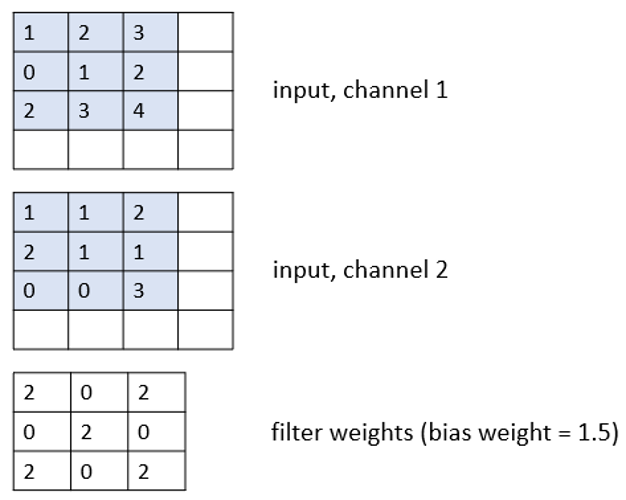

# Reading: Convolutional neural networks

## Instructions. 

Read Chapter 8 of our Chollet text, up to, but not including section 8.2.3.  You may need to also refer to lecture slides and the Keras documentation.  Optionally, read Chapter 14 of our Géron text, up to, but not including section 'CNN architectures'.  You may also like to refer to Chapter 16 of Glassner's Deep Learning text.

## Questions
Answer the following questions by editing file [cnn.txt](cnn.txt)

### Q1
Given an input image of shape (64, 64, 3) and a convolutional layer defined as Conv2D(16, (3, 3), padding='same'), what is the shape of the output of the layer?

### Q2
For a convolutional layer defined as Conv2D(8, (3,3), input_shape=(28,28,3)), how many trainable parameters are there, including biases?

### Q3
Given an input image of shape (28, 28, 3) and a convolutional layer defined as Conv2D(16, (4,4), strides=(2,2), padding='valid'), what is the shape of the output feature map?

### Q4
If you have a feature map of shape (24, 24, 16) and you apply a max pooling layer with pool_size=(2,2), what will be the shape of the output?

### Q5
The figure below shows an input with shape (4, 4, 2) and a convolutional filter of size (3,3).  What is the result of applying the filter to the part of the input indicated by the blue shading?  Make sure to note the bias value of the filter.

### Q6
(a/b/c)
What is the main purpose of a pooling layer in a CNN?
    a.	To increase the depth of the feature map
    b.	To reduce the spatial dimensions of the feature map
    c.	To connect all neurons to the output layer

### Q7
(a/b/c)
In a Keras convolutional layer, what does 'same' padding mean?

a.	The output feature map has the same width and height as the input.

b.	No padding is added to the input.

c.	Each filter has the same width and height as the input.

### Q8
(a/b/c)
What is the main goal of adding a batch normalization layer in a CNN?

a.	To prevent overfitting by randomly dropping neurons

b.	To speed training by normalizing activations

c.	To reduce the spatial dimensions of feature maps

