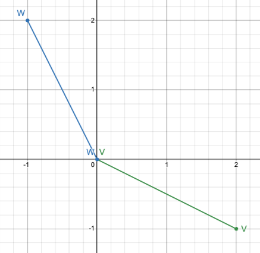

# Lab: Linear Algebra - Vectors

In the problems below we'll use these vectors, which I will write in text as (2,-1), (-1,2), and (1,0).

```math
v = \begin{bmatrix}
2 \\
-1
\end{bmatrix}
,

w = \begin{bmatrix}
-1 \\
2
\end{bmatrix}
,

b = \begin{bmatrix}
1 \\
0
\end{bmatrix}
```


## Q1
Draw $v$ and $w$ as arrows in a 2-axis coordinate system (like we did in lecture).  Draw $v + w$.  Draw $v - w$.

<details>
<summary>Answer</summary>


</details>

## Q2
What is the result of this linear combination of vectors v and w (defined in the previous problem)?

```math
2v - w
```

<details>
<summary>Answer</summary>

```math
2v - w = \begin{bmatrix}
5 \\
-4
\end{bmatrix}
```

</details>

Give your answer as a vector, and also draw it.

## Q3
Is there a linear combination of $v$ and $w$ that gives the vector $`\begin{bmatrix}1\\ 0\end{bmatrix}`$ ?  In other words, is there a value $b$ and a value $c$ such that $bv + cw = `\begin{bmatrix}1\\ 0\end{bmatrix}`$ ?

<details>
<summary>Answer</summary>

3.	$b = \frac{2}{3}$, $c = \frac{1}{3}$

</details>

## Q4
For every point in 2-dimensional space, can the point be expressed as the linear combination of $v$ and $w$?

<details>
<summary>Answer</summary>

Yes, as long as the two vectors aren't pointing in the same direction, they can be combined in a linear combination to obtain any point in the 2D space.

</details>


## Q5
Here is an equation involving vectors:
$x(1,-1) + y(0, 3) = (-1, 4)$
Can you write this instead as a system of 2 linear equations?  (In other words, 2 linear equations, one above the other.)

<details>
<summary>Answer</summary>

The two equations are x = -1, -x + 3y = 4

</details>

## Q6
What is the dot product of $v$ and $w$?

<details>
<summary>Answer</summary>

-4

</details>

## Q7
What is the dot product of $w$ and $v$?

<details>
<summary>Answer</summary>

Dot product is commutative, so the answer is the same as for problem 6.

</details>

## Q8
What is the (Euclidean) norm of $v$?

<details>
<summary>Answer</summary>

$\sqrt{2^2 + (-1)^2} = \sqrt{5}$

</details>

## Q9
What is the normalized version of $v$?

<details>
<summary>Answer</summary>

```math
\frac{
  \begin{bmatrix}
  2 \\
  1
  \end{bmatrix}
}{
  \sqrt{5}
}

=

\begin{bmatrix}
  \frac{2}{\sqrt{5}} \\
  \frac{1}{\sqrt{5}} 
\end{bmatrix}

```

</details>

## Q10
Write your own NumPy function that will return the dot product of two vectors:

```python
def dot_prod(u, v):
# your code
```

Compare the result of your function with your answers to problems 6 and 7.

<details>
<summary>Answer</summary>

The missing line can be:
`np.sqrt(np.square(x).sum())`

</details>

## Q11
It is interesting that $`||u|| = \sqrt{u \cdot u}`$ .  Prove this is true, using the relationship between dot product and cosine, and remember the value of cosine(0).  It's not hard -- work with your lab mate.


<details>
<summary>Answer</summary>

```math

u \cdot u
= \left\lVert u \right\rVert \left\lVert u \right\rVert cost(\phi) 
= \left\lVert u \right\rVert \left\lVert u \right\rVert 1
= \left\lVert u \right\rVert \left\lVert u \right\rVert 
= \sqrt{u u}

```

</details>

## Q12
Without googling, what's the dot product of two perpendicular vectors?

Check out this 3blue1brown video: [Essence of linear algebra, chapter 1](https://youtu.be/fNk_zzaMoSs)


<details>
<summary>Answer</summary>

0.  Two vectors are orthogonal (perpendicular) if and only if their dot product is 0.

</details>
