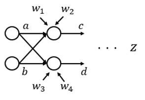

# Lab: Backprop for nets with branching structure

Work with your team.  This lab will prepare you for the upcoming homework.

## Q1
Below is a picture of part of a neural network.  
The variable z represents the output of the loss function.  
The circles represent neurons with the sigmoid function as the activation function.   
We are interested in the layer that has c and d for output.  
We are going to assume we're part way through backprop and have already computed $`\frac{\delta z}{\delta c}`$ and $`\frac{\delta z}{\delta d}`$.  Assume the values are $`\frace{\delta z}{\delta c} = 2`$ and $`\frac{\delta z}{\delta d} = 3`$.  Also, assume the following values: $`a = -1`$, $`b = 0.5`$, $`w1 = 1.5`$, $`w2 = -0.5`$, $`w3 = 2.1`$, $`w4 = 2`$.  From these, compute $`c`$ and $`d`$.

The equations are like this:

$`c = w_1 * a + w_2 * b`$

$`d = w_3 * a + w_4 * b`$

## Q2
Write down all the partial derivatives for the current layer.  For example, write the correct expressions for $`\frac{\delta c}{\delta a}`$, $`\frac{\delta c}{\delta b}`$, $`\frac{\delta c}{\delta w_1}`$, etc.  This is easy if you refer to the previous lecture.  Then evaluate the partial derivatives using what you have in [Q1](#Q1).

## Q3
Using the chain rule, combine your results for the last problem with the partial derivatives you assume you know (see [problem 1](#Q1)) to get the partial derivatives you will need to pass to the left.  For example, what is $`\frac{\delta z}{\delta a}(a,b)`$?
